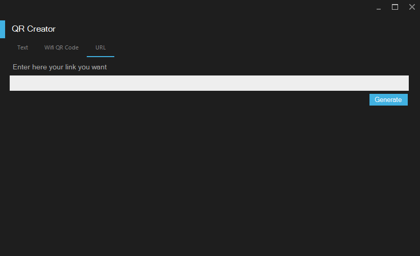
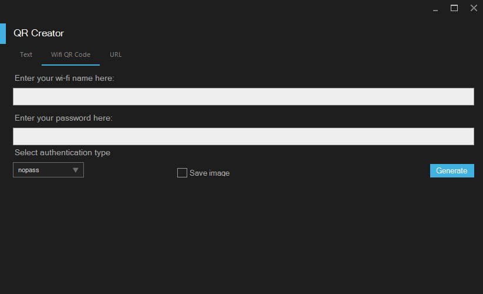
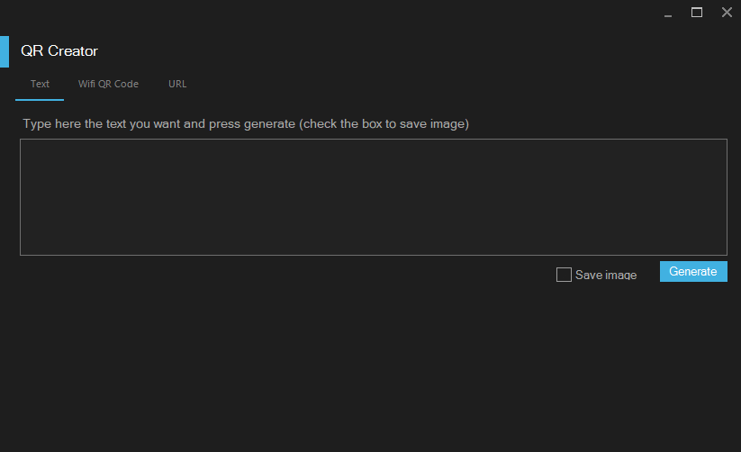
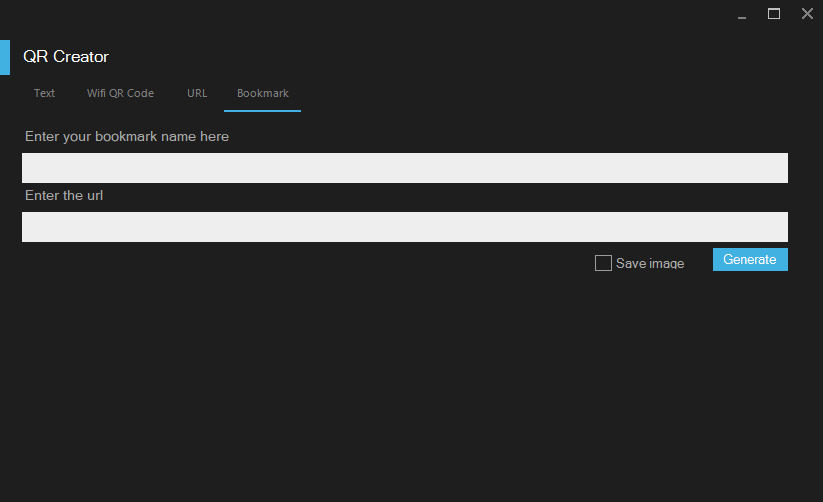

# QR Creator Tool
	Using the QRCoder library for .NET
	I a made a simple app that creates qr codes
 	

> Thanks QRCoder Contributors

>View the project here
[QRCoder](https://github.com/codebude/QRCoder)

## Updates 
- Now you can bookmark your pages
- Create a geolocation qr code 

## Features 
- 	 Text to QR code,
- 	 Wifi to QR Code,
- 	 Url to QR code
-    BookMark to QR code

## On Future 

- [ ] 	 Adding Skype call QR
- [ ] 	 Adding Whatsapp Message 
- [ ] 	 And many more

## Downloads 
- On [releases](https://github.com/BloddyRose/QRCreator/releases)  page will be an rar file [Release.rar](https://github.com/BloddyRose/QRCreator/releases/download/v2/Release.rar)

## Looking for teammates 
> 	Make a pull request to add your features

## Screenshots

Here are some screns of the app 

